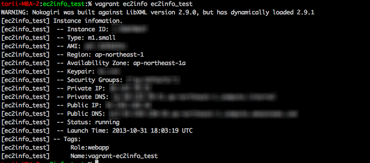

#  vagrant-ec2info

Show the ec2 metadata from vagrant. (required vagrant-aws)

## ScreenShot

## Usage

    vagrant ec2info <vm_name>

## Copyright

Copyright (c) 2013 toritori0318. See LICENSE.txt for
further details.

